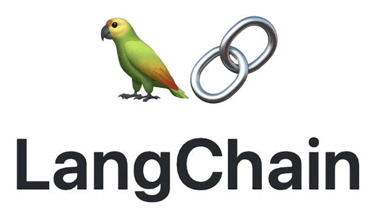

# Technologies
<!-- - ReactJS
- React Native
- Django
- Langchain
- Gemini -->

    
    
    
    
    

# Setting up the Mobile Application
1. Make sure you have NodeJS v20 LTS installed
2. `cd wiesec/mobile`
3. Run `npm install`
4. Run `npm run start`
5. Scan QR Code using Expo Go

# Setting up the Backend
1. Make sure you have Python 3.12 installed
2. Create a table in MySQL named `wiesec` for example
3. Install **Pipenv** by following this [tutorial](https://pipenv.pypa.io/en/latest/installation.html)
4. Clone the project using `git clone https://github.com/ystn/wiesec.git`
4. `cd wiesec/backend`
5. `cp .env.example .env`
6. Make needed changes to `.env` file
7. Execute `pipenv install`
8. Activate the virtual environment by running `pipenv shell`
9. Sync database by running `python manage.py migrate`
10. Start the development server by running `python manage.py runserver`